<!-- ════════════════════════════════════════════════════════════════════════════
  ★ G A L A X Y   P R O F I L E ★
  ════════════════════════════════════════════════════════════════════════════ -->

<!-- ════════════════════════════════════════════════════════════════════════════ -->
<!-- HEADER STARFIELD ANIMATION -->
<!-- ════════════════════════════════════════════════════════════════════════════ -->

  

  

<!-- STARS BANNER -->

  

<!-- TECH STACK PILLS -->

  
  
  
  
  
  
  
  

  
  
  
  

---

<!-- ════════════════════════════════════════════════════════════════════════════ -->
<!-- ✦ A B O U T   M E ✦ -->
<!-- ════════════════════════════════════════════════════════════════════════════ -->

### 🌌 About Me

  

> 💫 Advanced Information Technology student with hands-on experience in software development, specializing in **microservices architecture using .NET**, IT infrastructure management, and advanced technical support. Communication and proactive leadership skills, results-oriented approach, enabling effective work in diverse teams, bringing dynamism and innovative solutions to projects.

---

<!-- ════════════════════════════════════════════════════════════════════════════ -->
<!-- 🪐 T E C H N O L O G Y   S T A C K -->
<!-- ════════════════════════════════════════════════════════════════════════════ -->

### 🪐 Technology Stack

  

| Category | Technologies |
|----------|-------------|
| **🚀 Backend** |      |
| **🖥️ Frontend** |       |
| **📱 Mobile** |    |
| **💾 Databases** |       |
| **🏗️ Architecture** |     |
| **🛠️ Tools** |     |

---

<!-- ════════════════════════════════════════════════════════════════════════════ -->
<!-- 🌟 S O F T   S K I L L S -->
<!-- ════════════════════════════════════════════════════════════════════════════ -->

### 🌟 Soft Skills

  

---

<!-- ════════════════════════════════════════════════════════════════════════════ -->
<!-- 📡 C O N T A C T -->
<!-- ════════════════════════════════════════════════════════════════════════════ -->

  

### 📡 Contact Me

  

---

*✨ Thanks for visiting my profile! Let's build something amazing together. ✨*

  

